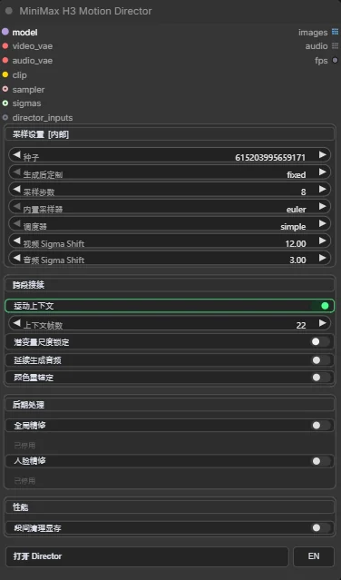
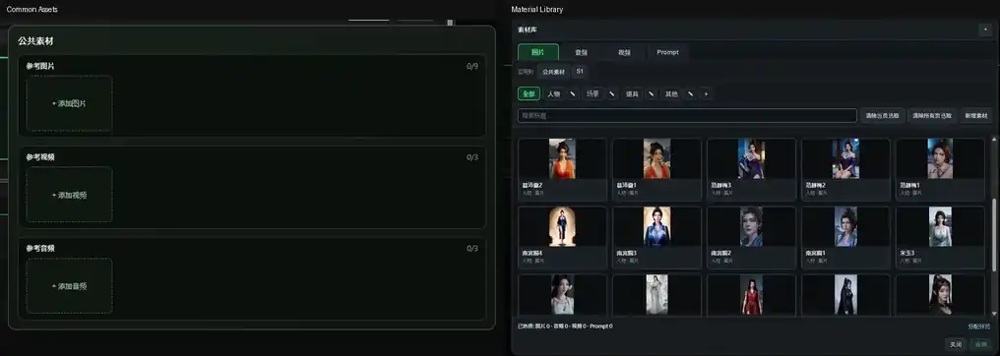
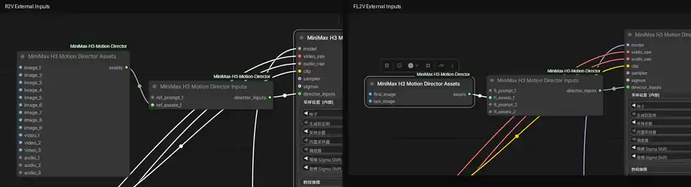

# ComfyUI MiniMax H3 Motion Director

[English](README.md) | [简体中文](README_zh.md)

**Current version: v1.1.0**

A ComfyUI Director node for **multi-segment MiniMax H3 video production**.

It brings segmentation, prompts, reference assets, cross-segment continuity, selective reruns, post-processing, live preview, result inspection, and final export into one production interface.

Standalone modes: `T2V / I2V / FL2V / R2V / V2V / RV2V`  
Mixed meta-mode: `T2V / I2V / FL2V / R2V / Source Video` per segment.



## v1.1.0 — Mixed Mode

v1.1.0 adds a native **Mixed** timeline. A single project can now combine different generation methods segment by segment instead of forcing the entire Director timeline to use one task type.

Example:

```text
S1  T2V
S2  Source Video + Identity  -> RV2V runtime
S3  I2V using Segment Result
S4  FL2V
S5  R2V
```

Mixed is implemented as a native Director mode, with its own timeline state and segment-local media, while sharing the normal Director output, continuity, Material Library, preview, post-processing, and result pipeline.

> **Media slot M1 — Mixed overview.** 
 It shows the Mixed timeline, per-boundary continuity controls, T2V, and Source Video segments in one project.

### Mixed segment modes

| Mixed segment mode | Main input | Runtime path | Notes |
|---|---|---|---|
| `T2V` | Prompt | T2V | Normal text-driven generation |
| `I2V` | Start image + Prompt | I2V path | Start image can be uploaded or come from an earlier Segment Result |
| `FL2V` | First/Last frame + Prompt | FL2V path | Either frame can use an uploaded image; Segment Result is supported where applicable |
| `R2V` | Prompt + reference media | R2V | Identity / scene / voice / motion references |
| `Source Video` | Source Video + Prompt | V2V or RV2V | No Identity Pictures -> V2V; Identity Pictures present -> RV2V |

### Source Video in Mixed

`Source Video` is deliberately one Mixed segment mode instead of exposing separate V2V and RV2V buttons.

```text
Source Video + 0 Identity Pictures  -> V2V
Source Video + Identity Pictures    -> RV2V
```

The actual Source Video is **segment-local and upload-only**. A Material Library video is a reference video, not the Source Video.

`Start sec` and `End sec` define the source range. The selected range determines the generated segment duration; Mixed does not arbitrarily time-stretch the source clip.

> **Media slot M2 — Source Video + Identity example.
 It shows Segment 2 with Source Range `2.5 -> 7.5` and the orange-clothed identity reference.

> **Media slot M3 — Additional Source Video identities.

side by side here. They show two more Source Video segments using different source ranges and identity references.

### Segment Result

Mixed can reuse a decoded static frame from an earlier generated segment.

Canonical behavior:

```text
Earlier Segment -> last frame
Earlier Segment -> explicit frame index
```

Typical uses:

- I2V: use an earlier Segment Result as the current start frame.
- FL2V: use an earlier Segment Result as First Frame or Last Frame.
- The source segment must be earlier in the timeline.

A Segment Result is a **static decoded frame**. It is not Motion Context. This means a Segment Result frame and cross-segment Motion Context can be used together when the mode allows it.

### Per-boundary continuity

Mixed continuity is configured directly between segment cards:

```text
[S1]  S1->S2  [S2]  S2->S3  [S3]
        visual         visual
        audio          audio
```

The boundary buttons request continuity for that specific link. The main Director node still provides the global masters and tuning:

- Motion Context
- Context Frames
- Latent Scale Lock
- Continue Generated Audio
- Color Re-anchor

The effective visual handoff is therefore the node-level Motion Context master **and** the boundary visual request. Audio follows the same master + boundary-request model.

If a mode has an explicit reset condition, the report explains the result. For example, an independently uploaded I2V start image resets visual context, so a visual request can be reported as requested but not actually applied.

### Mixed output and Material Library

Mixed uses one shared output canvas across all segments, using the same normal resolution selector (`aspect ratio + megapixels + FPS`) as the generation modes.

The global Material Library button applies to the currently selected Mixed segment and only exposes media that are legal for that segment mode. The actual Source Video remains upload-only.

### Mixed Results

The Results page supports:

- `Segment` — inspect one segment.
- `Multi` — preview/export a continuous segment range such as `1-2`, `1-3`, `2-4`, or `3-4`.
- `Final` — full final result and encoding controls.

The Multi range is applied to both preview and export.

> **Media slot M4 — source/identity materials.


> **Media slot M5 — final Mixed result video.
https://github.com/user-attachments/assets/7590e2db-0a49-43e7-b51d-d7a6faa21dc5


### Mixed v1 limitations

- Mixed v1 does not use the external `Director Inputs` group system; Mixed media are managed by the native Director UI.
- Source Bridge is not used by Mixed v1.
- Source Video itself is not supplied from the Material Library.
- Arbitrary Segment Result references are backward-only.

---

# Credits / License

This project is distributed as a whole under **GNU GPL v3.0**. See [`NOTICE`](NOTICE), [`LICENSE`](LICENSE), and [`LICENSES`](LICENSES) for third-party attribution and derivative-work details.

This project contains or modifies code / algorithms from:

- [AIMixer / ComfyUI_MiniMaxH3_Director](https://github.com/AIMixer/ComfyUI_MiniMaxH3_Director) — Apache-2.0
- [NikoDemon80 / ComfyUI-H3-Motion-Context](https://github.com/NikoDemon80/ComfyUI-H3-Motion-Context) — GPL-3.0
- [Carasibana / ComfyUI-H3-FaceRefine](https://github.com/Carasibana/ComfyUI-H3-FaceRefine) — MIT
- [Kijai / ComfyUI-KJNodes](https://github.com/kijai/ComfyUI-KJNodes) — GPL-3.0; portions of packed-latent preview / TAEHV behavior were informed by its implementation.

Thanks to all upstream projects and contributors.

## Why use Director?

A normal H3 workflow is great for generating a single clip. Once a project grows to 30 seconds, one minute, or longer, the workflow quickly becomes harder to manage:

- Every segment needs its own Prompt and assets.
- If only a few segments fail, you should not have to regenerate the whole video.
- A later segment may need to inherit motion, image state, or generated audio from the previous segment.
- The same character, scene, prop, or voice may appear across many segments.
- R2V / RV2V can involve many reference assets and quickly turn the node graph into a wiring problem.
- After generation you may still need upscaling, face refinement, live preview, and final encoding.

Motion Director puts those jobs back into one production interface while keeping ComfyUI's node graph composable.

## Core features

- Six standalone MiniMax H3 task modes: `T2V / I2V / FL2V / R2V / V2V / RV2V`.
- Native `Mixed` meta-mode with per-segment `T2V / I2V / FL2V / R2V / Source Video`.
- Multi-segment timeline with independent Prompt, mode, duration/range, and assets per segment.
- **Selective Run**: rerun selected segments instead of regenerating the entire sequence.
- Cross-segment Motion Context and generated-audio continuation.
- Segment Result frame reuse between earlier and later Mixed segments.
- Source Bridge for standalone V2V / RV2V source-video boundaries.
- Common Assets and persistent Material Library.
- Unified external `Director Inputs` / `Director Assets` architecture for standalone modes.
- Built-in sampling or external ComfyUI `SAMPLER + SIGMAS`.
- Global Refine and Face Refine post-processing.
- Director Live Preview.
- Results page with Segment / Multi-range / Final views and final video saving.
- Main node is an `OUTPUT_NODE` and still exposes `images / audio / fps` for downstream ComfyUI processing.

---

## Quick start

1. Add `MiniMax H3 Motion Director` to the workflow.
2. Connect MiniMax H3 `model`, `video_vae`, `audio_vae`, and `clip`.
3. Open Director.
4. Choose a standalone task mode or `Mixed`.
5. Create the required segments.
6. Fill in each Prompt and add media required by that segment mode.
7. Configure boundary continuity when a later segment should inherit visual or generated-audio context.
8. Use **Selective Run** when only some segments need regeneration.
9. Queue the workflow.
10. Watch Live Preview and inspect Segment / Multi / Final results.

---

# Generation: standalone task modes

The same Director can switch between all six standalone MiniMax H3 video tasks.


| Mode | Main input | External Director Inputs | Director Assets | Source Video | Typical use |
|---|---|---|---|---|---|
| `T2V` | Prompt | `prompt_N` | Not required | None | Text-driven storyboards and multi-shot clips |
| `I2V` | Prompt + start image | `image_prompt_N` + `image_N` | Not required | None | Generate from a character or scene image |
| `FL2V` | Prompt + first/last image | `fl_prompt_N` + `fl_assets_N` | `first_image / last_image` | None | Control the start and end state of a shot |
| `R2V` | Prompt + multimodal references | `ref_prompt_N` + `ref_assets_N` | 9 images / 3 videos / 3 audios | None | Character, voice, motion, object, and style references |
| `V2V` | Source Video + Prompt | Managed by Director | Not required | Uploaded in Director | Video redraw / transformation while keeping source motion |
| `RV2V` | Source Video + Prompt + image/audio references | `rv_prompt_N` + `rv_assets_N` | 9 images / 3 audios | Uploaded in Director | Source motion plus identity / voice references |

### T2V

Prompt-driven generation. Multi-segment T2V works well with Motion Context.

### I2V

Each group can provide its own starting image.

### FL2V

Each group can use a first frame, a last frame, or both.

### R2V

Each R2V Assets group can contain up to:

```text
Picture 1-9
Video 1-3
Audio 1-3
```

### V2V

Source Video is managed inside Director. Standalone V2V supports its dedicated source-video timeline and Source Bridge behavior.

### RV2V

RV2V uses Source Video as the primary motion/content source while allowing additional identity and audio references.

---

# Asset system



## Common Assets

Use Common Assets when the same character, scene, prop, or voice should be known by many standalone segments. Segment assets remain local to the current segment/group.

## Material Library

The persistent Material Library can store and reuse:

- Images
- Audio
- Video
- Prompts

In Mixed mode, the global Library button targets the currently selected segment and respects that segment's legal inputs.

---

# External Director Inputs / Assets

Other ComfyUI nodes can feed generated images, audio, or video into standalone Director modes through:

```text
MiniMax H3 Motion Director Assets
        ↓
MiniMax H3 Motion Director Inputs
        ↓
MiniMax H3 Motion Director
```



The repository exposes three Director-related nodes:

| Node | Purpose |
|---|---|
| `MiniMax H3 Motion Director` | Main production UI, execution, preview, post-processing, and result management |
| `MiniMax H3 Motion Director Inputs` | Dynamic Prompt / image / Assets inputs |
| `MiniMax H3 Motion Director Assets` | Packages mode-specific media for the current group |

External input shapes:

```text
T2V   prompt_N
I2V   image_prompt_N + image_N
FL2V  fl_prompt_N + fl_assets_N
R2V   ref_prompt_N + ref_assets_N
RV2V  rv_prompt_N + rv_assets_N
V2V   Source Video is managed by Director
```

Mixed v1 uses its native segment editor instead of this external group architecture.

---

# Main node controls

## Sampling

- Seed
- Control after generate
- Steps
- Built-in sampler
- Scheduler
- Video Sigma Shift
- Audio Sigma Shift

When both external `sampler + sigmas` are connected correctly, Director uses external sampling. Otherwise it falls back to internal sampling.

## Cross-segment continuity

- Motion Context
- Context Frames
- Latent Scale Lock
- Continue Generated Audio
- Color Re-anchor
- Source Bridge where applicable in standalone V2V / RV2V

In Mixed, these node-level switches/tuning values are global masters; each segment boundary independently requests visual and/or audio inheritance.

## Post-processing

- Global Refine
- Face Refine

## Performance

- Clear VRAM between segments

---

# Post Processing / Live Preview / Results


## Post Processing

Global Refine can run a second sampling/upscaling pass. Face Refine handles face detection, tracking, crop refinement, denoising, and compositing. They can be enabled independently.

## Live Preview

Director owns its preview UI and displays the active generation/post-processing stage. Completed stages can remain visible as snapshots for comparison.

## Results

Results is divided into:

```text
Segment
Multi
Final
```

`Multi` can select a continuous start/end segment range. `Final` provides save path, filename prefix, format, encoder, and encoding controls.

---

# Outputs

| Output | Type | Description |
|---|---|---|
| `images` | `IMAGE` list | Final generated video frames |
| `audio` | `AUDIO` list | Matching final audio |
| `fps` | `FLOAT` | Final frame rate |

`MiniMax H3 Motion Director` is also an `OUTPUT_NODE`, so it can execute as the end of a workflow without a downstream node.

---

# Multi-segment continuity

The basic model is:

```text
S1 -> S2 -> S3 -> S4
```

### Motion Context

Carries visual/motion context from the previous generated segment. `Context Frames` controls how much previous tail context is available.

### Latent Scale Lock

Reduces instability caused by latent-scale changes between segments.

### Continue Generated Audio

Carries generated-audio context across enabled boundaries.

### Color Re-anchor

Helps suppress long-chain color drift.

### Source Bridge

Used by standalone V2V / RV2V source-video segmentation. Mixed v1 does not use Source Bridge.

---

# Recommended workflows

### Text-driven multi-shot video

`T2V` + multiple Prompts + Motion Context.

### Continuous generated shots starting from artwork

`I2V` + start image / Segment Result where appropriate + Motion Context.

### Explicit start/end control

`FL2V` + first/last image or earlier Segment Result.

### Character / voice / multi-reference short-form production

`R2V` + reusable references + Material Library.

### Redrawing motion from an existing video

Standalone `V2V`, or Mixed `Source Video` without Identity Pictures.

### Existing motion + character identity replacement

Standalone `RV2V`, or Mixed `Source Video` with Identity Pictures.

### Real mixed production

Use different segment modes according to the shot instead of forcing the whole project into one task type. For example: T2V establishing shot -> Source Video/RV2V performance -> I2V or FL2V controlled ending.

---

# Installation

Open ComfyUI's `custom_nodes` directory:

```bash
cd ComfyUI/custom_nodes
git clone https://github.com/j955229/ComfyUI-MiniMax-H3-Motion-Director.git
cd ComfyUI-MiniMax-H3-Motion-Director
python -m pip install -r requirements.txt
```

If you use a Windows portable build, replace `python` with the Python executable used by that ComfyUI installation.

Restart ComfyUI completely after installation.

### Update

```bash
cd ComfyUI/custom_nodes/ComfyUI-MiniMax-H3-Motion-Director
git pull
```

After frontend updates, restart ComfyUI and hard-refresh the browser.

### Dependencies

- `opencv-python-headless` — source-video decoding.
- `imageio-ffmpeg` — source-audio extraction.
- `scenedetect` — smart scene splitting.

> Do not load the standalone `ComfyUI-H3-Motion-Context` at the same time. This project integrates and modifies the relevant H3 runtime patch, and loading both implementations can conflict.

---

# Usage notes

- External `sampler` and `sigmas` should be connected as a pair.
- `Director Inputs` is optional for standalone modes; Mixed v1 uses the native Director UI.
- FL2V Assets exposes first/last images rather than the R2V 9/3/3 asset layout.
- RV2V Assets does not expose Reference Video; Source Video is managed by Director.
- Do not use internal and external media sources for the same standalone group at the same time.
- Source Video range determines Mixed Source Video segment duration.
- Multi-segment, post-processing, and high-resolution jobs can significantly increase VRAM and system-memory pressure.
- If the interface shows an older frontend after updating, restart ComfyUI and hard-refresh the browser cache.
- Do not load the standalone `ComfyUI-H3-Motion-Context` alongside this project.
