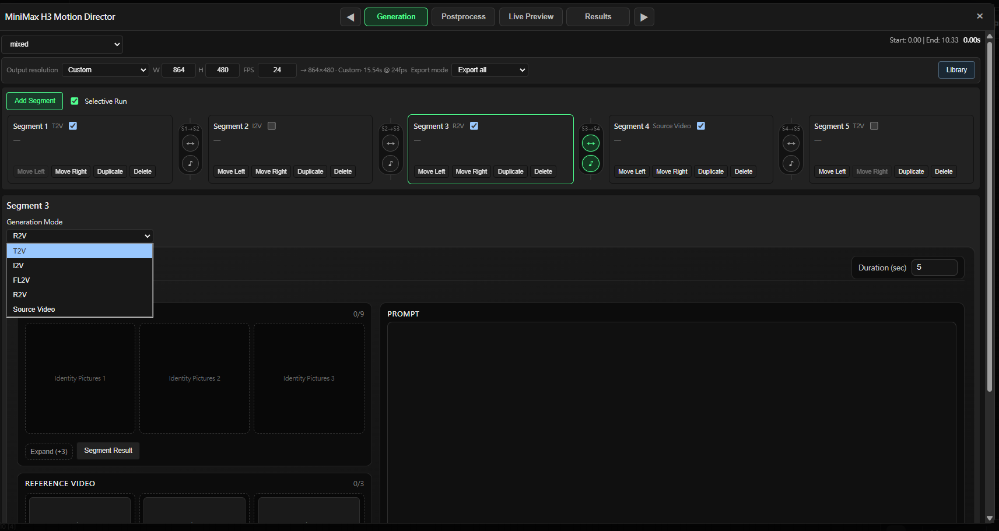
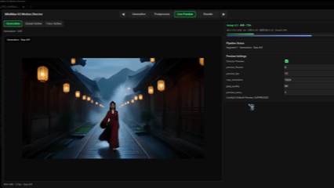
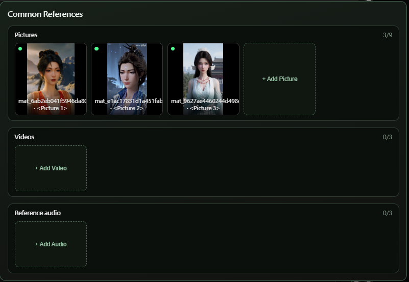
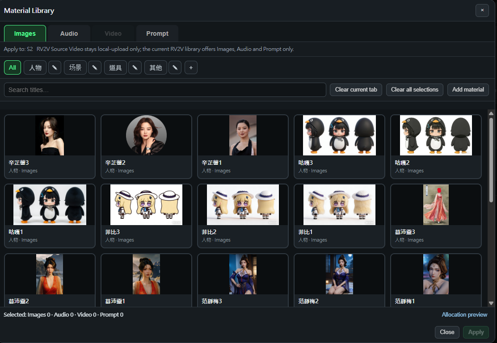
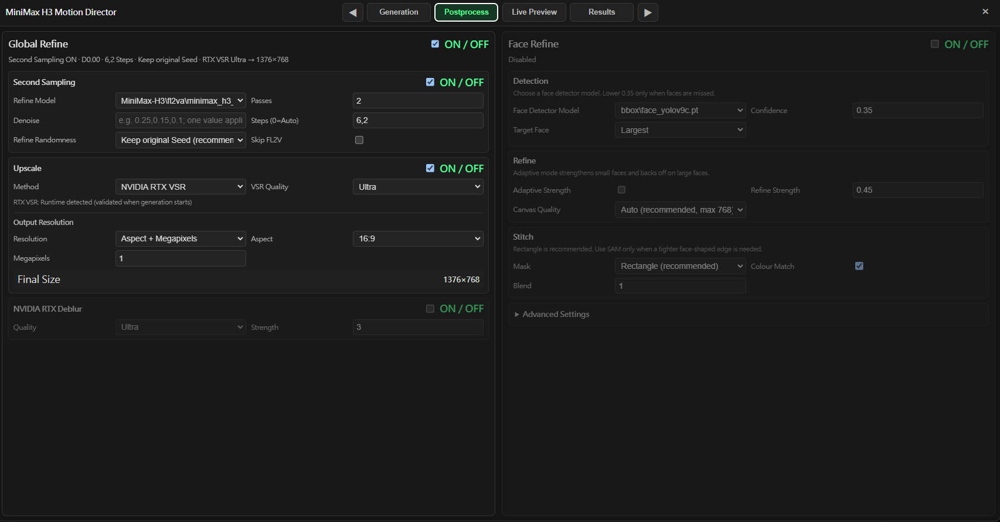
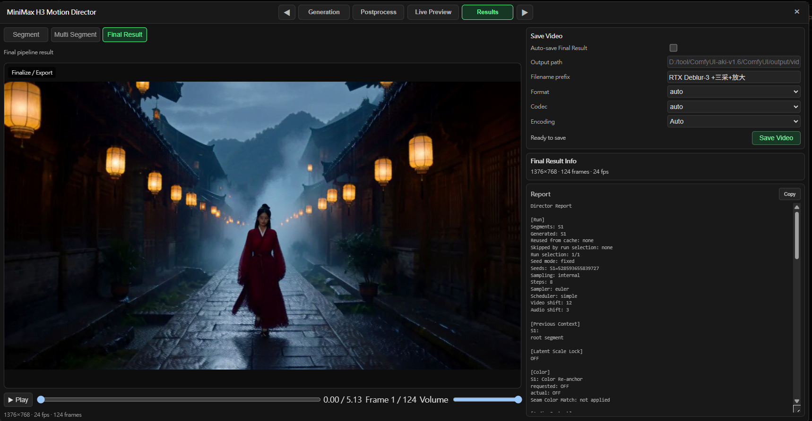
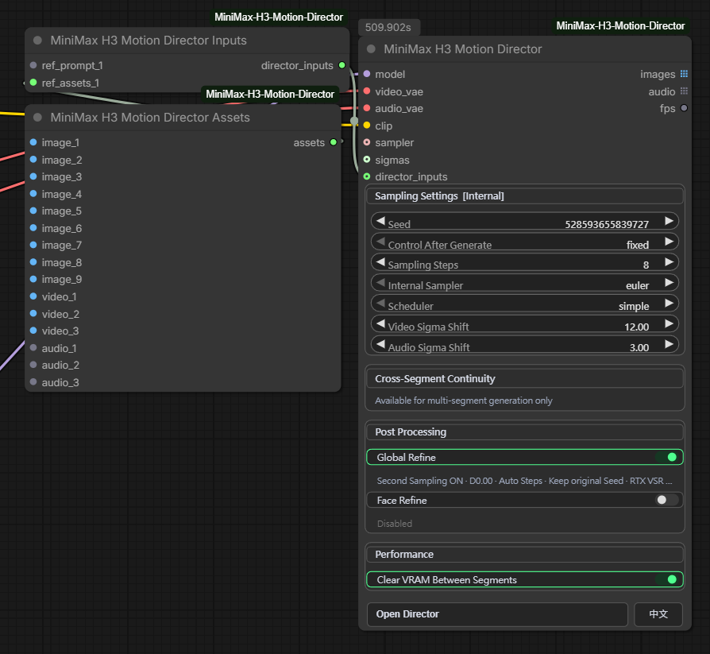

# MiniMax H3 Motion Director  [English](README.md) | [简体中文](README_zh.md)


**一个 Director，从单个 MiniMax H3 镜头到完整的多段视频项目。**

下面连结是教学，或者你想先往下看看介绍?

[English](docs/USER_GUIDE.md) | [简体中文](docs/USER_GUIDE_zh.md)

在一个生产界面中完成 `T2V / I2V / FL2V / R2V / V2V / RV2V`，按片段混合不同生成方式，在镜头之间传递画面与生成音频上下文，只重跑需要修改的片段，管理可复用素材，实时预览生成过程，完成后期精修并导出最终视频，而不需要把 ComfyUI 节点图堆成一堵墙。

> 当前版本：**v1.2.0** · Registry 包版本：**1.2.0**

<!-- IMAGE SLOT 1
把 Mixed + Selective Run 主截图放到：
docs/images/hero-mixed-selective-run.png
推荐素材：螢幕擷取畫面 2026-08-19 041546.png
-->



上图展示原生 **Mixed** 时间线：五个片段使用不同生成路径，片段边界可分别控制画面/音频连续性，同时启用 **Selective Run**，只重新生成选中的片段。

---

## 它能做什么

| 功能区域 | Motion Director 提供的能力 |
|---|---|
| **独立生成模式** | `T2V / I2V / FL2V / R2V / V2V / RV2V` |
| **Mixed Mode** | 每个片段可独立选择 `T2V / I2V / FL2V / R2V / Source Video` |
| **Selective Run** | 只重新生成选中的片段，而不是重跑整条时间线 |
| **跨段连续性** | Motion Context、Context Frames、Latent Scale Lock、生成音频延续、Color Re-anchor |
| **Segment Result 复用** | 将前面 Mixed 片段的解码帧复用为后续 I2V / FL2V 输入 |
| **Source Video 工作流** | 独立 V2V / RV2V 管理，以及用于源视频片段边界的 Source Bridge |
| **素材管理** | Common References + 持久化 Material Library，可管理图片、音频、视频与 Prompt |
| **采样** | 内置采样或外接 ComfyUI `SAMPLER + SIGMAS` |
| **后期处理** | Global Refine、放大、可选 NVIDIA RTX VSR / Deblur、Face Refine |
| **预览与输出** | Director Live Preview、Segment / Multi Segment / Final Result、最终视频保存 |
| **ComfyUI 集成** | 外接 `Director Inputs / Director Assets`，以及 `images / audio / fps` 输出 |

Motion Director 本身是 `OUTPUT_NODE`，可以直接作为工作流终点运行，同时仍然把最终画面帧、音频和 FPS 暴露给下游 ComfyUI 节点继续处理。

---

## Live Preview

Motion Director 有自己的实时预览界面，不只依赖普通 sampler preview。工作流运行时可以显示当前生成阶段，也能继续显示后续后处理阶段。

<!-- IMAGE SLOT 2
把 Live Preview GIF 放到：
docs/images/live-preview.gif
推荐素材：Video Project 1(1).gif
-->



---

## Mixed Mode：在同一条时间线混合不同生成方式

普通 H3 工作流通常把每次生成当成独立片段。Mixed Mode 则把整个项目当成一条时间线。

例如：

```text
S1  T2V
S2  I2V
S3  R2V
S4  Source Video
S5  T2V
```

每个片段都有自己的模式、Prompt、时长或 Source Range，以及当前模式允许使用的媒体输入。

### Mixed 片段模式

| Mixed 片段模式 | 运行路径 | 主要用途 |
|---|---|---|
| `T2V` | T2V | 文本驱动镜头 |
| `I2V` | I2V | 从上传图片或前面 Segment Result 开始生成 |
| `FL2V` | FL2V | 控制首帧、尾帧或两者 |
| `R2V` | R2V | 人物 / 场景 / 动作 / 声音参考 |
| `Source Video` | V2V 或 RV2V | 使用源视频动作，并可额外加入人物参考图 |

`Source Video` 在 Mixed 中故意只保留一个模式：

```text
Source Video + 0 张 Identity Pictures  -> V2V
Source Video + Identity Pictures       -> RV2V
```

Source Video 属于当前片段本身。`Start sec` 和 `End sec` 定义 Source Range，所选范围直接决定这个片段的时长。

### 按片段边界控制连续性

Mixed 可以直接在两个片段卡片之间决定是否请求连续性：

```text
[S1]  S1 -> S2  [S2]  S2 -> S3  [S3]
        visual          visual
        audio           audio
```

主节点上的连续性设置仍然是全局总开关，因此可以让某些边界继续继承，也可以让另一些边界主动重置。

### Segment Result

Mixed Mode 可以把前面已经生成完成的片段解码成静态帧，再给后面的片段使用：

```text
Earlier Segment -> last frame
Earlier Segment -> explicit frame index
```

常见用途：

- 前面片段 -> I2V 起始图
- 前面片段 -> FL2V 首帧
- 前面片段 -> FL2V 尾帧

Segment Result 是静态帧引用，与 Motion Context 是两套独立机制；模式允许时，两者可以同时使用。

### Selective Run

长项目通常不需要每次把所有镜头重新生成。启用 **Selective Run** 后，只勾选需要再跑一次的片段；其余片段在已有缓存或可用源结果时保持不变。

这也是 Director 存在的核心原因之一：修 Shot 3，不应该自动意味着 Shot 1、2、4、5 全部重新付一次生成成本。

---

## 独立 H3 模式

同一个 Director 也支持六种独立 MiniMax H3 任务模式。

| 模式 | 主要输入 | 典型用途 |
|---|---|---|
| `T2V` | Prompt | 文本驱动的多镜头生成 |
| `I2V` | Prompt + 起始图 | 让人物图或场景图动起来 |
| `FL2V` | Prompt + 首帧/尾帧 | 明确控制镜头起点和终点 |
| `R2V` | Prompt + 多模态参考 | 人物、风格、动作、场景、声音或物体参考 |
| `V2V` | Source Video + Prompt | 保留源动作/内容结构并重新生成画面 |
| `RV2V` | Source Video + Prompt + 参考素材 | 源视频动作 + 人物/音频参考 |

R2V 的每个 Assets 组最多可以包含：

```text
Picture 1-9
Video 1-3
Audio 1-3
```

独立 V2V / RV2V 使用 Director 专用的 Source Video 工作流。对于符合条件的源视频分段边界，Source Bridge 可以重新生成一小段过渡，而不是把分段只当成硬切。

---

## Common References

Common References 是项目级共享素材，可以让多个独立片段共同使用。适合重复出现的人物、场景、道具、动作参考和音频，不需要每段都重新添加一次。

<!-- IMAGE SLOT 3
把 Common References 截图放到：
docs/images/common-references.png
推荐素材：螢幕擷取畫面 2026-08-19 040543(1).png
-->



片段专属素材仍然只属于当前片段/组。执行时，Common References 与本段素材会组合成当前任务真正使用的参考序列。

---

## Material Library

持久化 **Material Library** 用来保存希望跨镜头、跨项目重复使用的素材。

可保存：

- 图片
- 音频
- 视频
- Prompt

图片可以按人物、场景、道具或其他类型分类。搜索和分配都直接在 Director UI 中完成，不需要每次重新从硬盘寻找同一份素材。

<!-- IMAGE SLOT 4
把 Material Library 截图放到：
docs/images/material-library.png
推荐素材：螢幕擷取畫面 2026-08-19 035702(1).png
-->



在 Mixed Mode 中，素材库会作用于当前选中的片段，并且只显示该片段模式允许使用的素材。真正的 Mixed `Source Video` 仍然是本地上传，不会把素材库里的 Reference Video 当成源视频。

---

## 后期处理

Director 不只负责第一遍生成，也可以继续处理后期，不需要每个项目都额外搭一套后处理节点图。

<!-- IMAGE SLOT 5
把 Postprocess 截图放到：
docs/images/postprocess.png
推荐素材：螢幕擷取畫面 2026-08-19 034623(1).png
-->



### Global Refine

Global Refine 可以运行第二遍采样，并可在精修前对片段/结果进行放大。

根据当前安装的运行环境和模型，可使用的路径包括：

- 普通 resize / upscale
- ComfyUI upscale models
- NVIDIA RTX Video Super Resolution
- NVIDIA RTX Deblur
- 第二遍 H3 sampling / refinement

如果 Global Refine 失败，Director 会保留已经完成的第一遍结果，而不是把整个生成结果丢掉。

### Face Refine

Face Refine 提供集成的人脸修复路径，包括：

- 人脸检测与追踪
- 基于 crop 的 H3 再生成
- 自适应 refine strength
- mask / stitch 控制
- color matching

如果没有检测到可用人脸，或 Face Refine 本身失败，会保留已经组装完成的原结果作为 fallback。

---

## Results：Segment、Multi Segment、Final Result

结果直接在 Director 内管理，而不是最后只得到一个没有上下文的输出 batch。

<!-- IMAGE SLOT 6
把 Results 截图放到：
docs/images/results-final.png
推荐素材：螢幕擷取畫面 2026-08-19 035629(1).png
-->



Results 页面分为三层：

- **Segment** — 检查单个生成片段
- **Multi Segment** — 预览/导出一个连续片段区间
- **Final Result** — 检查并保存完整最终结果

Final 页面还提供视频保存设置和 Director Report。Report 会记录真实运行配置、连续性状态、采样信息以及后处理状态。

公开节点输出保持简单：

| 输出 | 类型 | 说明 |
|---|---|---|
| `images` | `IMAGE` list | 最终生成视频帧 |
| `audio` | `AUDIO` list | 对应最终音频 |
| `fps` | `FLOAT` | 最终帧率 |

---

## 外接 Director Inputs / Assets

Director 是一体化生产界面，但不是封闭黑盒。其他 ComfyUI 节点仍然可以通过外接输入架构，把 Prompt 和媒体传入独立模式。

<!-- IMAGE SLOT 7
把 External Inputs / Assets 节点截图放到：
docs/images/external-inputs.png
推荐素材：螢幕擷取畫面 2026-08-19 040419(1).png
-->



```text
MiniMax H3 Motion Director Assets
        ↓
MiniMax H3 Motion Director Inputs
        ↓
MiniMax H3 Motion Director
```

仓库提供三个 Director 相关节点：

| 节点 | 用途 |
|---|---|
| `MiniMax H3 Motion Director` | 主 UI、执行、连续性、预览、后处理与结果管理 |
| `MiniMax H3 Motion Director Inputs` | 动态 Prompt / image / Assets 输入 |
| `MiniMax H3 Motion Director Assets` | 打包当前输入组所需的模式专属媒体 |

独立模式的外接输入形状：

```text
T2V   prompt_N
I2V   image_prompt_N + image_N
FL2V  fl_prompt_N + fl_assets_N
R2V   ref_prompt_N + ref_assets_N
RV2V  rv_prompt_N + rv_assets_N
V2V   Source Video 由 Director 管理
```

Mixed v1 使用原生 Director 时间线/媒体 UI，不走外接 group 系统。

---

## 采样与性能

Motion Director 可以使用内置 sampler 设置，也可以接入外部 ComfyUI 采样链。

同时连接：

```text
SAMPLER
SIGMAS
```

Director 就会使用外部采样；否则使用内部 sampler、scheduler、step 数、Video Sigma Shift 和 Audio Sigma Shift。

对于较长任务，**Clear VRAM Between Segments** 可以在片段之间释放模型/缓存，降低显存压力。它是用部分速度换取更低显存占用的稳定性选项，不是性能加速选项。

---

## 安装

### ComfyUI-Manager / Comfy Registry

搜索：

```text
MiniMax H3 Motion Director
```

### 手动安装

```bash
cd ComfyUI/custom_nodes
git clone https://github.com/j955229/ComfyUI-MiniMax-H3-Motion-Director.git
cd ComfyUI-MiniMax-H3-Motion-Director
python -m pip install -r requirements.txt
```

如果使用 Windows portable 版本，请使用该 ComfyUI 实际使用的 Python 可执行文件来运行 `pip`。

安装后请完整重启 ComfyUI。如果更新包含前端文件，也请完整重启 ComfyUI 并 hard refresh 浏览器。

---

## 要求 / 兼容性

Motion Director 需要**较新的、已经包含官方 MiniMax H3 支持的 ComfyUI 版本**，其中包括当前运行路径依赖的官方 MiniMax H3 conditioning 节点。

核心 Python 依赖已写入项目 package / requirements 文件。部分后处理功能还有额外可选依赖，例如：

- NVIDIA RTX VSR / Deblur 需要兼容的 NVIDIA VFX runtime/package 和支持的 NVIDIA 硬件
- Face Refine detector / SAM 路径需要 UI 中选择的相应 detector/model 依赖
- Upscale Model 模式需要兼容的 ComfyUI upscale model

对于可选后处理阶段，Director 的设计目标是在该阶段无法运行时保留前面已经可用的结果。

> 不要同时加载独立版 `ComfyUI-H3-Motion-Context`。Motion Context 兼容逻辑已经集成到 Motion Director 中。

---

## Mixed v1 说明

- Mixed v1 使用原生 Director UI 管理媒体，不使用外接 `Director Inputs` group。
- Mixed `Source Video` 只能本地上传；Material Library 中的视频是 Reference Video，不是实际 Source Video。
- Source Bridge 是独立 V2V / RV2V 功能，Mixed v1 不使用 Source Bridge。
- Segment Result 只能向前引用：后面的片段可以复用前面结果，不能引用未来片段。
- 连续性功能可以改善跨段衔接，但不保证每次生成都得到完全不可见的边界；MiniMax H3 本身仍可能产生画面、动作、光照或人物一致性漂移。

---

## Credits / 上游项目

Motion Director 本身就是一个集成型项目。它明确包含、修改或参考了多个现有 ComfyUI H3 项目的代码/算法，而不是把所有组件都包装成“从零独立发明”。

- [AIMixer / ComfyUI_MiniMaxH3_Director](https://github.com/AIMixer/ComfyUI_MiniMaxH3_Director) — Apache-2.0
- [NikoDemon80 / ComfyUI-H3-Motion-Context](https://github.com/NikoDemon80/ComfyUI-H3-Motion-Context) — GPL-3.0
- [Carasibana / ComfyUI-H3-FaceRefine](https://github.com/Carasibana/ComfyUI-H3-FaceRefine) — MIT
- [Kijai / ComfyUI-KJNodes](https://github.com/kijai/ComfyUI-KJNodes) — GPL-3.0；部分 packed-latent preview / TAEHV 行为参考其实现

感谢所有上游作者和贡献者。

准确的第三方署名和派生说明见 [`NOTICE`](NOTICE)、[`LICENSE`](LICENSE) 和 [`LICENSES`](LICENSES)。

## License

本项目整体以 **GNU GPL v3.0** 发布。
